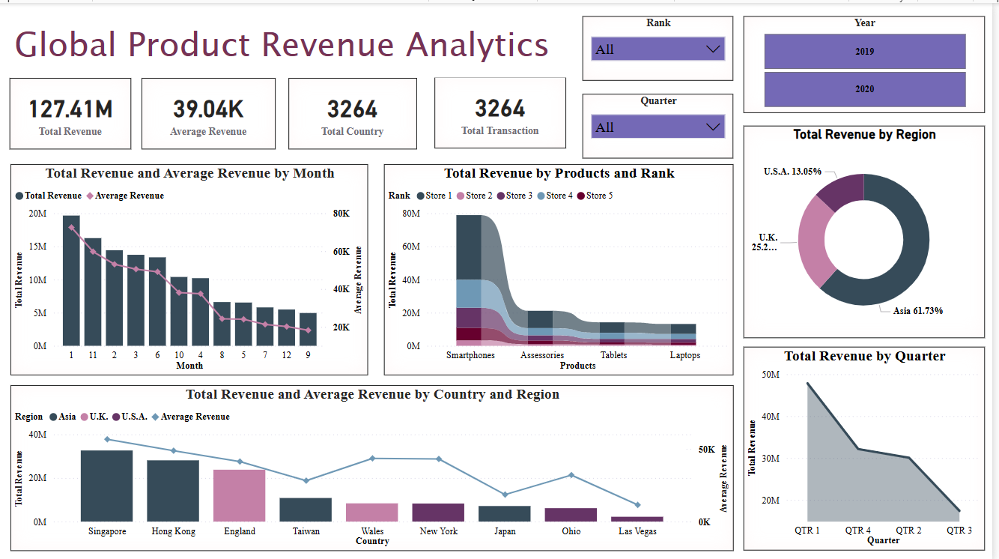

# Global Revenue Intelligence Dashboard - Power BI

This dashboard evaluates global product sales data across multiple stores, time periods, and geographies.

## 📌 Objective
To identify top-performing products and peak revenue periods across countries, ranks, and quarters.

## 📊 Features
- Dual-axis monthly trend: Total Revenue vs Average Revenue
- Regional sales breakdown with donut and bar charts
- Product vs Rank-wise stacked area chart
- Quarterly revenue trends
- Dynamic filters for year, rank, and quarter

## 🛠 Tools Used
- Power BI
- DAX (for revenue, averages, and rankings)
- Synthetic global sales dataset

## 🖼️ Dashboard Preview:

---

## 🔗 Connect with Me
[LinkedIn Profile](https://www.linkedin.com/in/tgnandini/)
